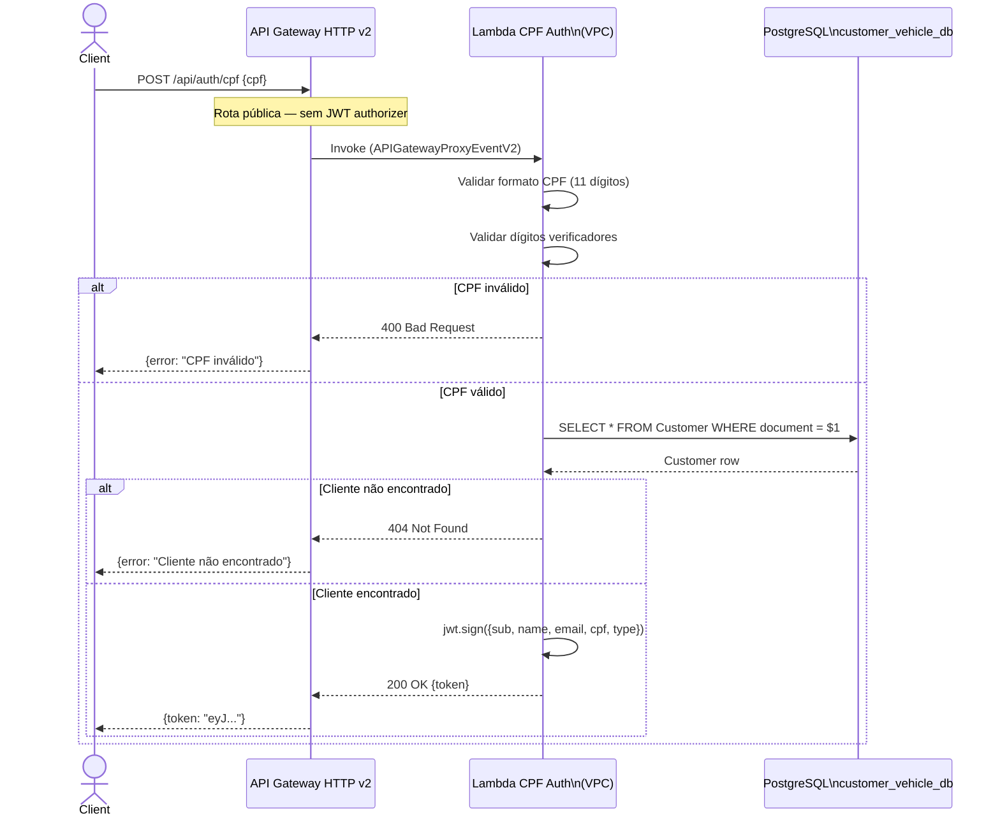
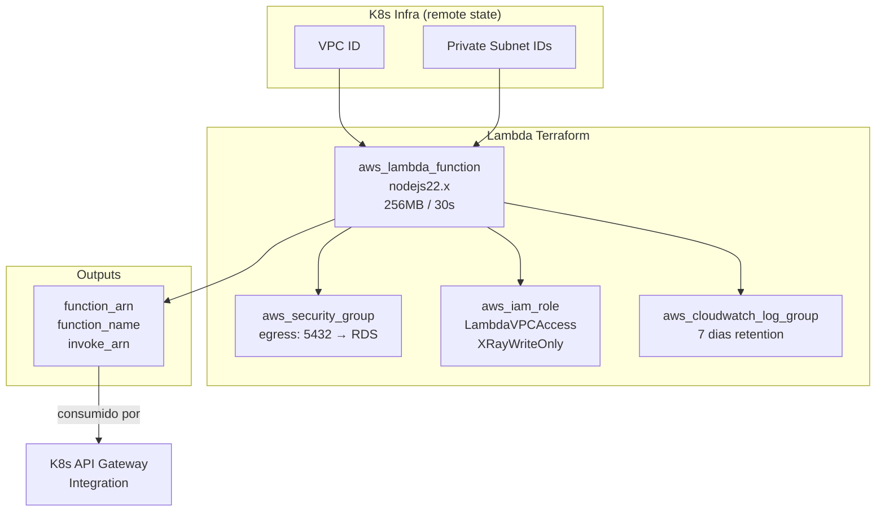
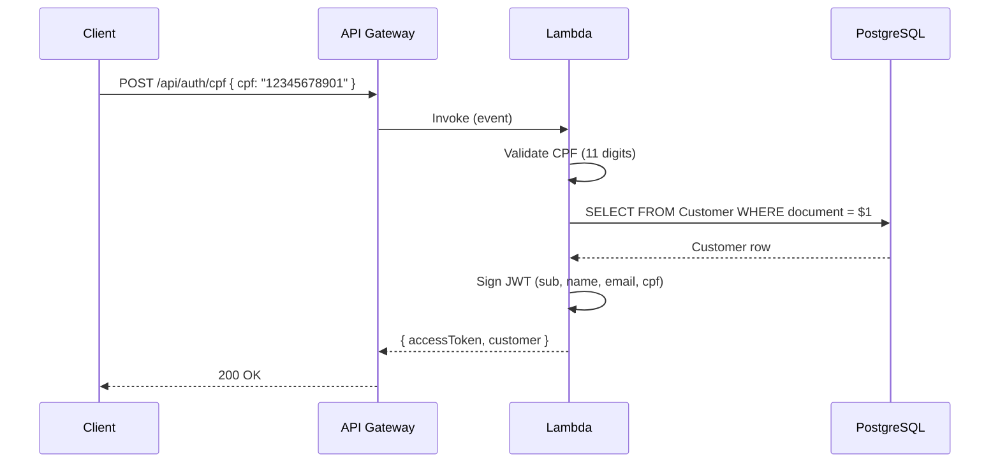

# Lambda — Autenticação por CPF

> AWS Lambda que autentica clientes pelo CPF, consultando o banco PostgreSQL e retornando um JWT assinado. Invocada diretamente pelo API Gateway HTTP v2 sem passar pelo cluster EKS.

## Sumário

- [1. Visão Geral](#1-visão-geral)
- [2. Arquitetura](#2-arquitetura)
- [3. Tecnologias Utilizadas](#3-tecnologias-utilizadas)
- [4. Comunicação entre Serviços](#4-comunicação-entre-serviços)
- [5. Diagramas](#5-diagramas)
- [6. Execução e Setup](#6-execução-e-setup)
- [7. Pontos de Atenção](#7-pontos-de-atenção)
- [8. Boas Práticas e Padrões](#8-boas-práticas-e-padrões)
- [9. Repositórios Relacionados](#9-repositórios-relacionados)

---

## 1. Visão Geral

### Propósito

A **Lambda de Autenticação CPF** é a porta de entrada do sistema para clientes. Ela:

1. **Recebe um CPF** via `POST /api/auth/cpf`
2. **Valida o formato e os dígitos verificadores** (algoritmo brasileiro)
3. **Consulta o banco `customer_vehicle_db`** (PostgreSQL RDS) pelo CPF
4. **Emite um JWT** com claims de identidade do cliente (nome, e-mail, CPF, tipo)

### Problema que Resolve

Em uma arquitetura com API Gateway + EKS, criar uma rota de autenticação dentro dos microserviços violaria a separação de responsabilidades. A Lambda resolve isso:

- Rota pública (`/api/auth/cpf`) sem JWT authorizer — isolada do restante da API
- Execução sem container sempre rodando (cold start tolerável para autenticação)
- Acesso direto ao banco via VPC private subnets (sem chamadas HTTP inter-serviço)
- Infra provisionada separadamente, com deploy independente

### Papel na Arquitetura

| Papel                        | Descrição                                                       |
| ---------------------------- | --------------------------------------------------------------- |
| **Autenticador de clientes** | Única rota pública que emite JWT                                |
| **Consumidor de dados**      | Lê tabela `Customer` do banco do Customer & Vehicle Service     |
| **Dependência do K8s**       | Lê remote state Terraform do K8s para obter VPC/subnets         |
| **Provedor de identidade**   | `function_arn` exportado para o K8s repo configurar API Gateway |

**Ordem de deploy**: K8s Infra → **Lambda (este repo)** → DB → Microserviços

---

## 2. Arquitetura

### Estrutura do Projeto

```
src/
└── handlers/
    ├── auth.ts          # Handler principal — validação + DB + JWT
    └── auth.test.ts     # Testes unitários com mocks
terraform/
├── main.tf              # Lambda function, Security Group, IAM role, CloudWatch
├── variables.tf         # Inputs (VPC, subnets, DB credentials, JWT secret)
├── outputs.tf           # function_arn, function_name, invoke_arn
└── environments/
    ├── staging/
    │   └── terraform.tfvars
    └── production/
        └── terraform.tfvars
```

### Decisões Arquiteturais

| Decisão                                        | Justificativa                                                            | Trade-off                                                              |
| ---------------------------------------------- | ------------------------------------------------------------------------ | ---------------------------------------------------------------------- |
| **Lambda serverless** (vs microserviço no EKS) | Rota pública esporádica; zero custo quando idle; sem gestão de container | Cold start de ~500ms na primeira chamada; limite de 29s no API Gateway |
| **Sem framework** (Node.js puro)               | Minimiza bundle e cold start; autenticação é lógica simples              | Sem middleware, roteamento ou DI — tudo manual                         |
| **Pool de conexões PostgreSQL**                | `pg.Pool` permite reutilizar conexões entre invocações warm              | Conexões abertas podem exceder `max_connections` sob alta carga        |
| **VPC attachment**                             | Acesso privado ao RDS sem expor o banco publicamente                     | VPC aumenta cold start; requer subnets e security groups corretos      |
| **Terraform remote state**                     | Lê VPC/subnet IDs do K8s infra sem hardcode                              | Dependência de deploy — K8s infra deve existir antes                   |

---

## 3. Tecnologias Utilizadas

| Tecnologia       | Versão | Propósito                   |
| ---------------- | ------ | --------------------------- |
| **Node.js**      | 22     | Runtime da Lambda           |
| **TypeScript**   | 5.x    | Linguagem                   |
| **pg**           | 8.x    | Driver PostgreSQL (sem ORM) |
| **jsonwebtoken** | 9      | Emissão de JWT              |
| **Terraform**    | ≥ 1.9  | Provisão da infra AWS       |
| **Jest**         | 29     | Testes unitários            |

**Infraestrutura AWS:**

- `aws_lambda_function` — runtime `nodejs22.x`, 256 MB, timeout 30s
- `aws_security_group` — permite saída para RDS na porta 5432
- `aws_iam_role` — `AWSLambdaVPCAccessExecutionRole` + `AWSXrayWriteOnlyAccess`
- `aws_cloudwatch_log_group` — retenção de 7 dias

---

## 4. Comunicação entre Serviços

### Invocação

| Origem                  | Tipo          | Descrição                                        |
| ----------------------- | ------------- | ------------------------------------------------ |
| **API Gateway HTTP v2** | Invoke Lambda | Rota pública `POST /api/auth/cpf` sem authorizer |

### Dependências de Runtime

| Serviço                              | Tipo        | Descrição                           |
| ------------------------------------ | ----------- | ----------------------------------- |
| **PostgreSQL (customer_vehicle_db)** | TCP via VPC | SELECT por CPF na tabela `Customer` |

### Dependências de Deploy

| Repositório                        | Tipo                   | Dado Consumido                            |
| ---------------------------------- | ---------------------- | ----------------------------------------- |
| `fiap-13soat-auto-repair-shop-k8s` | Terraform remote state | VPC ID, subnet IDs privadas               |
| `fiap-13soat-auto-repair-shop-k8s` | Output consumidor      | `invoke_arn` exportado para o API Gateway |

### Contrato da API

**Request:**

```json
POST /api/auth/cpf
Content-Type: application/json

{ "cpf": "12345678901" }
```

**Response (200):**

```json
{
  "token": "eyJhbGciOiJIUzI1NiIsInR5cCI6IkpXVCJ9..."
}
```

**JWT Claims:**

```json
{
  "sub": "uuid-do-cliente",
  "name": "João Silva",
  "email": "joao@exemplo.com",
  "cpf": "12345678901",
  "type": "customer",
  "iss": "auto-repair-shop",
  "aud": "auto-repair-shop-api",
  "exp": 1234567890
}
```

**Erros:**
| Status | Cenário |
|---|---|
| `400` | CPF com formato inválido |
| `400` | CPF com dígitos verificadores incorretos |
| `404` | CPF não encontrado no banco |
| `500` | Erro de conexão com banco |

---

## 5. Diagramas

### Fluxo de Autenticação



### Infraestrutura Terraform



---

## 6. Execução e Setup

### Pré-requisitos

- Node.js 22+, npm
- AWS CLI configurado (ou credenciais via environment)
- Terraform ≥ 1.9
- PostgreSQL acessível (local ou via VPN para RDS)

### Desenvolvimento Local

```bash
# Instalar dependências
npm install

# Build TypeScript
npm run build

# Rodar testes
npm test

# Com cobertura
npm run test:coverage
```

### Deploy via Terraform

```bash
cd terraform

# Inicializar (baixa providers e lê remote state)
terraform init -backend-config="environments/staging/backend.tfvars"

# Planejar
terraform plan -var-file="environments/staging/terraform.tfvars"

# Aplicar
terraform apply -var-file="environments/staging/terraform.tfvars"
```

### Variáveis de Ambiente (Lambda)

| Variável                  | Descrição                             | Obrigatório           |
| ------------------------- | ------------------------------------- | --------------------- |
| `DB_HOST`                 | Host do PostgreSQL (RDS endpoint)     | Sim                   |
| `DB_PORT`                 | Porta PostgreSQL                      | Sim (default: `5432`) |
| `DB_NAME`                 | Nome do banco (`customer_vehicle_db`) | Sim                   |
| `DB_USER`                 | Usuário do banco                      | Sim                   |
| `DB_PASSWORD`             | Senha do banco (via Secrets Manager)  | Sim                   |
| `DB_SSL`                  | Habilitar SSL (`true` em produção)    | Não                   |
| `JWT_ACCESS_TOKEN_SECRET` | Chave secreta para assinar JWT        | Sim                   |
| `JWT_EXPIRES_IN`          | Duração do token                      | Não (default: `15m`)  |

---

## 7. Pontos de Atenção

### Cold Start e VPC

Lambdas dentro de VPC têm cold start mais lento (~500-1000ms adicionais) por precisar alocar ENIs. Para mitigar:

- Use **Provisioned Concurrency** se latência P99 for crítica
- O pool `pg.Pool` reutiliza conexões entre invocações warm, reduzindo latência subsequente

### Pool de Conexões e RDS

A Lambda usa `pg.Pool` com conexões persistentes entre invocações warm. Em cenários de alta concorrência Lambda, o número de conexões abertas pode ultrapassar `max_connections` do RDS. Monitore via CloudWatch e considere **RDS Proxy** para ambientes de alta carga.

### Validação de CPF

A Lambda implementa a validação completa do algoritmo de dígitos verificadores do CPF. CPFs com dígitos repetidos (ex.: `111.111.111-11`) são considerados inválidos. O Customer & Vehicle Service **não valida os dígitos** — a Lambda é o único ponto de validação completa.

### Secrets Manager

Em produção, `DB_PASSWORD` e `JWT_ACCESS_TOKEN_SECRET` devem ser injetados via AWS Secrets Manager (não como environment variables em texto plano). O Terraform provisiona o IAM com permissão de leitura.

### Deploy Order

A Lambda **deve ser deployed após o K8s Infra**, pois lê o remote state do Terraform para obter VPC/subnet IDs. O K8s Infra **deve ser deployed após a Lambda** para configurar a integração do API Gateway com o `invoke_arn` da Lambda. Use um pipeline CI/CD com dependência explícita.

---

## 8. Boas Práticas e Padrões

### Segurança

- CPF validado antes de qualquer query no banco — previne queries desnecessárias
- Sem logging de CPF ou dados pessoais em texto plano (apenas hash ou primeiros/últimos dígitos)
- JWT assina claims mínimos necessários (`sub`, `type`, `iss`, `aud`, `exp`)
- Comunicação banco-Lambda via VPC private subnets (sem exposição pública)

### Validação

- Algoritmo de verificação de dígitos do CPF implementado em TypeScript puro
- Rejeita CPFs com menos de 11 dígitos, com caracteres não numéricos e com dígitos repetidos

### Observabilidade

- CloudWatch Logs com retenção de 7 dias
- AWS X-Ray habilitado para rastreamento de invocações
- Métricas nativas Lambda: Duration, Errors, Throttles, ConcurrentExecutions

### Testes

- Testes unitários com Jest e mocks do `pg` e `jsonwebtoken`
- Cobertura mínima: 80%

| Environment                    | URL                                                     |
| ------------------------------ | ------------------------------------------------------- |
| **Auth Endpoint (Production)** | `https://api.auto-repair-shop.com/api/auth/cpf`         |
| **Auth Endpoint (Staging)**    | `https://staging-api.auto-repair-shop.com/api/auth/cpf` |

---

## Table of Contents

- [Purpose](#purpose)
- [Architecture](#architecture)
- [Technologies](#technologies)
- [Project Structure](#project-structure)
- [Getting Started](#getting-started)
- [API Contract](#api-contract)
- [CI/CD & Deployment](#cicd--deployment)
- [Documentation](#documentation)
- [API Documentation](#api-documentation)
- [Related Repositories](#related-repositories)

---

## Purpose

This Lambda function provides a **CPF-based authentication** flow for customers of the Auto Repair Shop:

1. Receives a `POST /api/auth/cpf` request via API Gateway
2. Sanitizes and validates the CPF (11 digits)
3. Queries the `Customer` table in RDS PostgreSQL
4. If found, generates a **JWT access token** with customer claims (id, name, email, cpf)
5. Returns the token and customer info to the client

This allows customers to authenticate using only their CPF document number, without needing a password.

---

## Architecture


### How It Works



### Infrastructure

- **Runtime**: Node.js 22.x on AWS Lambda (256 MB, 30s timeout)
- **Network**: VPC-attached in private subnets (same as RDS)
- **Database**: Direct connection via `pg` (node-postgres) — no ORM
- **Security**: Security Group restricts outbound to RDS port only
- **Logging**: CloudWatch Log Group with configurable retention
- **Cross-stack**: Reads VPC/subnet info from K8s Infrastructure remote state; exports function ARN/invoke ARN consumed by K8s Infrastructure

---

## Technologies

| Technology         | Version | Purpose                           |
| ------------------ | ------- | --------------------------------- |
| **Node.js**        | 22      | Runtime                           |
| **TypeScript**     | 5.7     | Language                          |
| **AWS Lambda**     | —       | Serverless compute                |
| **pg**             | —       | PostgreSQL client (node-postgres) |
| **jsonwebtoken**   | —       | JWT token signing                 |
| **Jest**           | 29      | Unit testing (with ts-jest)       |
| **ESLint**         | 9       | Code linting (TypeScript-ESLint)  |
| **Terraform**      | ≥ 1.5.0 | Infrastructure as Code            |
| **AWS Provider**   | ~5.0    | Terraform AWS resource management |
| **S3**             | —       | Terraform state backend           |
| **DynamoDB**       | —       | Terraform state locking           |
| **GitHub Actions** | —       | CI/CD pipelines                   |

---

## Project Structure

```
├── .github/workflows/
│   ├── ci.yml                  # Lint, test, terraform validate on PRs
│   ├── cd-staging.yml          # Deploy to staging on merge to main
│   └── cd-production.yml       # Deploy to production (manual trigger)
├── terraform/
│   ├── main.tf                 # Lambda, IAM, CloudWatch, SG + remote state
│   ├── variables.tf            # Input variables
│   ├── outputs.tf              # Exported values (consumed by K8s repo)
│   ├── placeholder.zip         # Initial dummy deployment package
│   └── environments/
│       ├── staging/
│       │   └── terraform.tfvars
│       └── production/
│           └── terraform.tfvars
├── src/
│   └── handlers/
│       ├── auth-handler.ts     # Lambda handler implementation
│       └── auth-handler.test.ts # Unit tests
├── package.json
├── tsconfig.json
├── jest.config.js
└── eslint.config.mjs
```

---

## Getting Started

### Prerequisites

- Node.js ≥ 22
- Terraform ≥ 1.5.0
- AWS CLI configured with appropriate credentials
- S3 bucket for state: `auto-repair-shop-terraform-state`
- DynamoDB table for locking: `auto-repair-shop-terraform-locks`
- **K8s Infrastructure already provisioned** (this project reads its VPC/subnet outputs via remote state)

### Local Development

```bash
# Install dependencies
npm install

# Build
npm run build

# Run tests
npm test

# Run tests with coverage
npm run test:coverage

# Lint
npm run lint

# Create deployment package (build + zip)
npm run package
```

### Terraform Commands

```bash
cd terraform

# Initialize
terraform init

# Plan (staging)
terraform plan -var-file=environments/staging/terraform.tfvars

# Plan (production)
terraform plan -var-file=environments/production/terraform.tfvars -out=tfplan

# Apply
terraform apply tfplan
```

### Required Terraform Variables

| Variable                  | Description           | Sensitive |
| ------------------------- | --------------------- | --------- |
| `db_host`                 | RDS database hostname | No        |
| `db_username`             | Database username     | Yes       |
| `db_password`             | Database password     | Yes       |
| `jwt_access_token_secret` | JWT signing secret    | Yes       |

### Key Outputs

| Output          | Description                      |
| --------------- | -------------------------------- |
| `function_arn`  | Lambda function ARN              |
| `function_name` | Lambda function name             |
| `invoke_arn`    | Invoke ARN (used by API Gateway) |

These outputs are consumed by the K8s Infrastructure repository via `terraform_remote_state`.

---

## API Contract

### `POST /api/auth/cpf`

Authenticates a customer by CPF document number.

**Request:**

```json
{
  "cpf": "12345678901"
}
```

**Success Response (200):**

```json
{
  "accessToken": "eyJhbGciOiJIUzI1NiIs...",
  "customer": {
    "id": "uuid",
    "name": "John Doe",
    "email": "john@example.com"
  }
}
```

**Error Responses:**

| Status | Body                                                      | Condition                 |
| ------ | --------------------------------------------------------- | ------------------------- |
| 400    | `{ "message": "CPF is required" }`                        | Missing CPF in body       |
| 400    | `{ "message": "Invalid CPF format. Must be 11 digits." }` | CPF not 11 digits         |
| 404    | `{ "message": "Customer not found" }`                     | No customer with that CPF |
| 500    | `{ "message": "Internal server error" }`                  | Unexpected error          |

**JWT Token Claims:**

| Claim   | Description                     |
| ------- | ------------------------------- |
| `sub`   | Customer UUID                   |
| `name`  | Customer name                   |
| `email` | Customer email                  |
| `cpf`   | Customer CPF document           |
| `type`  | `"customer"`                    |
| `iss`   | `https://auto-repair-shop.auth` |
| `aud`   | `auto-repair-shop-api`          |
| `exp`   | Configurable (default: 15min)   |

---

## CI/CD & Deployment

### CI — Continuous Integration (`.github/workflows/ci.yml`)

**Trigger:** Pull requests to any branch.

| Step               | Description                 |
| ------------------ | --------------------------- |
| Lint               | ESLint code standards check |
| Test               | Jest unit tests             |
| Terraform Validate | Terraform config validation |

### CD — Continuous Deployment

| Workflow            | Trigger                | Environment |
| ------------------- | ---------------------- | ----------- |
| `cd-staging.yml`    | Push to `main`         | Staging     |
| `cd-production.yml` | Manual / after staging | Production  |

Each CD workflow:

1. Builds TypeScript and creates zip artifact (`npm run package`)
2. Runs Terraform apply (provisions/updates infrastructure)
3. Uploads Lambda function code via AWS CLI

All workflows use **OIDC-based AWS credential assumption**.

### Required GitHub Secrets

| Secret                    | Description              |
| ------------------------- | ------------------------ |
| `AWS_ROLE_ARN`            | OIDC role for AWS access |
| `DB_HOST`                 | RDS hostname             |
| `DB_USERNAME`             | Database username        |
| `DB_PASSWORD`             | Database password        |
| `JWT_ACCESS_TOKEN_SECRET` | JWT signing secret       |

---

## Documentation

- **Architecture Decision Records (ADRs)**: [`docs/adrs/`](docs/adrs/)
  - [ADR-001: Estratégia de Autenticação com JWT via Lambda](docs/adrs/ADR-001-autenticacao-jwt-lambda.md)
- **Request for Comments (RFCs)**: [`docs/rfcs/`](docs/rfcs/)
  - [RFC-001: Estratégia de Autenticação e Autorização](docs/rfcs/RFC-001-estrategia-autenticacao.md)
- **Sequence Diagram**: Included in this README ([Architecture](#architecture))
- **API Contract**: Included in this README ([API Contract](#api-contract))

### Branch Protection

All repositories follow these branch protection rules (configured in GitHub):

- **Branch `main`**: protected — no direct pushes allowed
- **Merge via Pull Request only**: all changes require a PR with at least 1 approval
- **CI must pass**: lint, tests, and Terraform validate must succeed before merge
- **Automatic deploys**: staging (on push to `staging`), production (on push to `main`)

---

## 9. Repositórios Relacionados

Este repositório faz parte do ecossistema **Auto Repair Shop**. Abaixo estão os demais repositórios da arquitetura final:

| Repositório                                                                                                                                | Descrição                                                       |
| ------------------------------------------------------------------------------------------------------------------------------------------ | --------------------------------------------------------------- |
| [fiap-13soat-auto-repair-shop-execution-service](https://github.com/vctrlima/fiap-13soat-auto-repair-shop-execution-service)               | Rastreamento de execução dos serviços e notificações por e-mail |
| [fiap-13soat-auto-repair-shop-billing-service](https://github.com/vctrlima/fiap-13soat-auto-repair-shop-billing-service)                   | Geração de faturas e processamento de pagamentos                |
| [fiap-13soat-auto-repair-shop-work-order-service](https://github.com/vctrlima/fiap-13soat-auto-repair-shop-work-order-service)             | Ordens de serviço e Saga Orchestrator                           |
| [fiap-13soat-auto-repair-shop-customer-vehicle-service](https://github.com/vctrlima/fiap-13soat-auto-repair-shop-customer-vehicle-service) | Cadastro de clientes e veículos                                 |
| [fiap-13soat-auto-repair-shop-k8s](https://github.com/vctrlima/fiap-13soat-auto-repair-shop-k8s)                                           | Infraestrutura AWS — VPC, EKS, ALB, API Gateway                 |
| [fiap-13soat-auto-repair-shop-db](https://github.com/vctrlima/fiap-13soat-auto-repair-shop-db)                                             | Banco de dados RDS PostgreSQL e migrações Flyway                |
