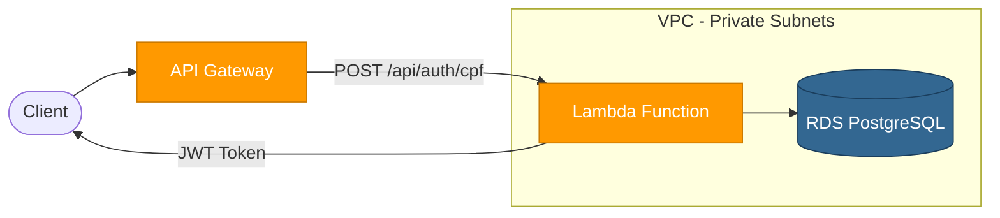
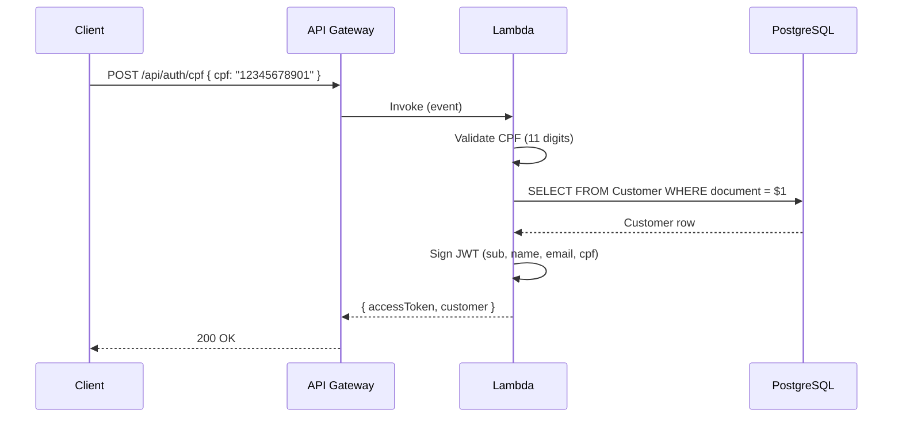

# Auto Repair Shop — Lambda (CPF Authentication)

AWS Lambda function for **customer authentication via CPF**. Receives a CPF number, looks up the customer in the RDS PostgreSQL database, and returns a signed JWT token. Invoked by the API Gateway provisioned in the [K8s Infrastructure](https://github.com/vctrlima/fiap-13soat-auto-repair-shop-k8s) repository.

> **Part of the [Auto Repair Shop](https://github.com/fiap-13soat) ecosystem.**
> Deploy order: K8s Infra → **Lambda (this repo)** → DB → App

---

## Deploy Links

| Environment                    | URL                                                     |
| ------------------------------ | ------------------------------------------------------- |
| **Auth Endpoint (Production)** | `https://api.auto-repair-shop.com/api/auth/cpf`         |
| **Auth Endpoint (Staging)**    | `https://staging-api.auto-repair-shop.com/api/auth/cpf` |

---

## Table of Contents

- [Purpose](#purpose)
- [Architecture](#architecture)
- [Technologies](#technologies)
- [Project Structure](#project-structure)
- [Getting Started](#getting-started)
- [API Contract](#api-contract)
- [CI/CD & Deployment](#cicd--deployment)
- [Documentation](#documentation)
- [API Documentation](#api-documentation)
- [Related Repositories](#related-repositories)

---

## Purpose

This Lambda function provides a **CPF-based authentication** flow for customers of the Auto Repair Shop:

1. Receives a `POST /api/auth/cpf` request via API Gateway
2. Sanitizes and validates the CPF (11 digits)
3. Queries the `Customer` table in RDS PostgreSQL
4. If found, generates a **JWT access token** with customer claims (id, name, email, cpf)
5. Returns the token and customer info to the client

This allows customers to authenticate using only their CPF document number, without needing a password.

---

## Architecture



### How It Works



### Infrastructure

- **Runtime**: Node.js 22.x on AWS Lambda (256 MB, 30s timeout)
- **Network**: VPC-attached in private subnets (same as RDS)
- **Database**: Direct connection via `pg` (node-postgres) — no ORM
- **Security**: Security Group restricts outbound to RDS port only
- **Logging**: CloudWatch Log Group with configurable retention
- **Cross-stack**: Reads VPC/subnet info from K8s Infrastructure remote state; exports function ARN/invoke ARN consumed by K8s Infrastructure

---

## Technologies

| Technology         | Version | Purpose                           |
| ------------------ | ------- | --------------------------------- |
| **Node.js**        | 22      | Runtime                           |
| **TypeScript**     | 5.7     | Language                          |
| **AWS Lambda**     | —       | Serverless compute                |
| **pg**             | —       | PostgreSQL client (node-postgres) |
| **jsonwebtoken**   | —       | JWT token signing                 |
| **Jest**           | 29      | Unit testing (with ts-jest)       |
| **ESLint**         | 9       | Code linting (TypeScript-ESLint)  |
| **Terraform**      | ≥ 1.5.0 | Infrastructure as Code            |
| **AWS Provider**   | ~5.0    | Terraform AWS resource management |
| **S3**             | —       | Terraform state backend           |
| **DynamoDB**       | —       | Terraform state locking           |
| **GitHub Actions** | —       | CI/CD pipelines                   |

---

## Project Structure

```
├── .github/workflows/
│   ├── ci.yml                  # Lint, test, terraform validate on PRs
│   ├── cd-staging.yml          # Deploy to staging on merge to main
│   └── cd-production.yml       # Deploy to production (manual trigger)
├── terraform/
│   ├── main.tf                 # Lambda, IAM, CloudWatch, SG + remote state
│   ├── variables.tf            # Input variables
│   ├── outputs.tf              # Exported values (consumed by K8s repo)
│   ├── placeholder.zip         # Initial dummy deployment package
│   └── environments/
│       ├── staging/
│       │   └── terraform.tfvars
│       └── production/
│           └── terraform.tfvars
├── src/
│   └── handlers/
│       ├── auth-handler.ts     # Lambda handler implementation
│       └── auth-handler.test.ts # Unit tests
├── package.json
├── tsconfig.json
├── jest.config.js
└── eslint.config.mjs
```

---

## Getting Started

### Prerequisites

- Node.js ≥ 22
- Terraform ≥ 1.5.0
- AWS CLI configured with appropriate credentials
- S3 bucket for state: `auto-repair-shop-terraform-state`
- DynamoDB table for locking: `auto-repair-shop-terraform-locks`
- **K8s Infrastructure already provisioned** (this project reads its VPC/subnet outputs via remote state)

### Local Development

```bash
# Install dependencies
npm install

# Build
npm run build

# Run tests
npm test

# Run tests with coverage
npm run test:coverage

# Lint
npm run lint

# Create deployment package (build + zip)
npm run package
```

### Terraform Commands

```bash
cd terraform

# Initialize
terraform init

# Plan (staging)
terraform plan -var-file=environments/staging/terraform.tfvars

# Plan (production)
terraform plan -var-file=environments/production/terraform.tfvars -out=tfplan

# Apply
terraform apply tfplan
```

### Required Terraform Variables

| Variable                  | Description           | Sensitive |
| ------------------------- | --------------------- | --------- |
| `db_host`                 | RDS database hostname | No        |
| `db_username`             | Database username     | Yes       |
| `db_password`             | Database password     | Yes       |
| `jwt_access_token_secret` | JWT signing secret    | Yes       |

### Key Outputs

| Output          | Description                      |
| --------------- | -------------------------------- |
| `function_arn`  | Lambda function ARN              |
| `function_name` | Lambda function name             |
| `invoke_arn`    | Invoke ARN (used by API Gateway) |

These outputs are consumed by the K8s Infrastructure repository via `terraform_remote_state`.

---

## API Contract

### `POST /api/auth/cpf`

Authenticates a customer by CPF document number.

**Request:**

```json
{
  "cpf": "12345678901"
}
```

**Success Response (200):**

```json
{
  "accessToken": "eyJhbGciOiJIUzI1NiIs...",
  "customer": {
    "id": "uuid",
    "name": "John Doe",
    "email": "john@example.com"
  }
}
```

**Error Responses:**

| Status | Body                                                      | Condition                 |
| ------ | --------------------------------------------------------- | ------------------------- |
| 400    | `{ "message": "CPF is required" }`                        | Missing CPF in body       |
| 400    | `{ "message": "Invalid CPF format. Must be 11 digits." }` | CPF not 11 digits         |
| 404    | `{ "message": "Customer not found" }`                     | No customer with that CPF |
| 500    | `{ "message": "Internal server error" }`                  | Unexpected error          |

**JWT Token Claims:**

| Claim   | Description                     |
| ------- | ------------------------------- |
| `sub`   | Customer UUID                   |
| `name`  | Customer name                   |
| `email` | Customer email                  |
| `cpf`   | Customer CPF document           |
| `type`  | `"customer"`                    |
| `iss`   | `https://auto-repair-shop.auth` |
| `aud`   | `auto-repair-shop-api`          |
| `exp`   | Configurable (default: 15min)   |

---

## CI/CD & Deployment

### CI — Continuous Integration (`.github/workflows/ci.yml`)

**Trigger:** Pull requests to any branch.

| Step               | Description                 |
| ------------------ | --------------------------- |
| Lint               | ESLint code standards check |
| Test               | Jest unit tests             |
| Terraform Validate | Terraform config validation |

### CD — Continuous Deployment

| Workflow            | Trigger                | Environment |
| ------------------- | ---------------------- | ----------- |
| `cd-staging.yml`    | Push to `main`         | Staging     |
| `cd-production.yml` | Manual / after staging | Production  |

Each CD workflow:

1. Builds TypeScript and creates zip artifact (`npm run package`)
2. Runs Terraform apply (provisions/updates infrastructure)
3. Uploads Lambda function code via AWS CLI

All workflows use **OIDC-based AWS credential assumption**.

### Required GitHub Secrets

| Secret                    | Description              |
| ------------------------- | ------------------------ |
| `AWS_ROLE_ARN`            | OIDC role for AWS access |
| `DB_HOST`                 | RDS hostname             |
| `DB_USERNAME`             | Database username        |
| `DB_PASSWORD`             | Database password        |
| `JWT_ACCESS_TOKEN_SECRET` | JWT signing secret       |

---

## Documentation

- **Architecture Decision Records (ADRs)**: [`docs/adrs/`](docs/adrs/)
  - [ADR-001: Estratégia de Autenticação com JWT via Lambda](docs/adrs/ADR-001-autenticacao-jwt-lambda.md)
- **Request for Comments (RFCs)**: [`docs/rfcs/`](docs/rfcs/)
  - [RFC-001: Estratégia de Autenticação e Autorização](docs/rfcs/RFC-001-estrategia-autenticacao.md)
- **Sequence Diagram**: Included in this README ([Architecture](#architecture))
- **API Contract**: Included in this README ([API Contract](#api-contract))

### Branch Protection

All repositories follow these branch protection rules (configured in GitHub):

- **Branch `main`**: protected — no direct pushes allowed
- **Merge via Pull Request only**: all changes require a PR with at least 1 approval
- **CI must pass**: lint, tests, and Terraform validate must succeed before merge
- **Automatic deploys**: staging (on push to `staging`), production (on push to `main`)

---

## API Documentation

This Lambda handles a single endpoint (`POST /api/auth/cpf`) routed by API Gateway. For the full API documentation including all other endpoints:

> **Swagger UI**: Available at `http://localhost:3000/docs` when running the [App](https://github.com/vctrlima/fiap-13soat-auto-repair-shop-app).

---

## Related Repositories

This project is part of the **Auto Repair Shop** ecosystem. Deploy in this order:

| #   | Repository                                                                                         | Description                                     |
| --- | -------------------------------------------------------------------------------------------------- | ----------------------------------------------- |
| 1   | [`fiap-13soat-auto-repair-shop-k8s`](https://github.com/vctrlima/fiap-13soat-auto-repair-shop-k8s) | AWS infrastructure (VPC, EKS, ALB, API Gateway) |
| 2   | **`fiap-13soat-auto-repair-shop-lambda`** (this repo)                                              | CPF authentication Lambda function              |
| 3   | [`fiap-13soat-auto-repair-shop-db`](https://github.com/vctrlima/fiap-13soat-auto-repair-shop-db)   | Database infrastructure (RDS PostgreSQL)        |
| 4   | [`fiap-13soat-auto-repair-shop-app`](https://github.com/vctrlima/fiap-13soat-auto-repair-shop-app) | Application API                                 |
